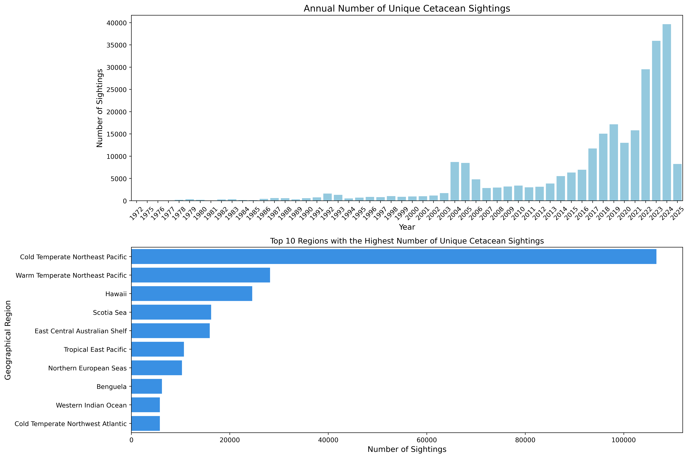
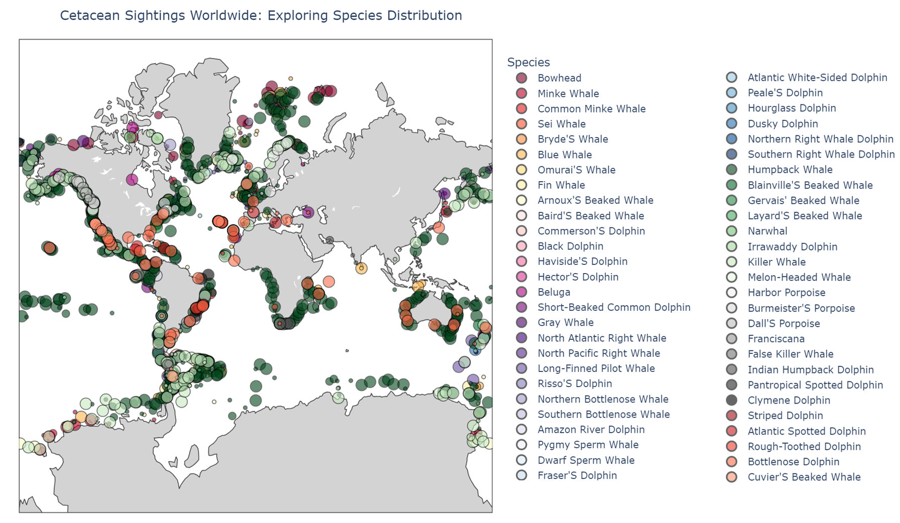
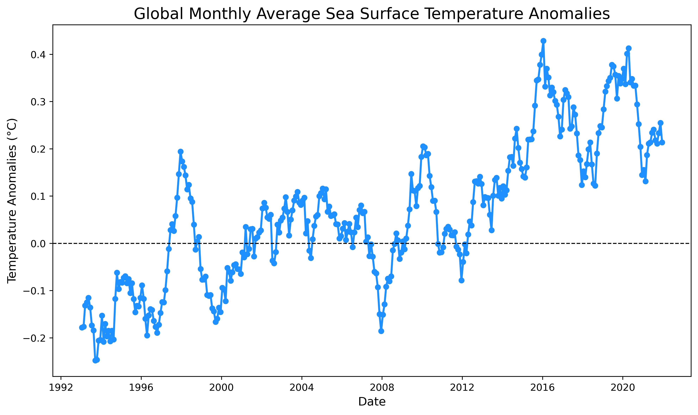
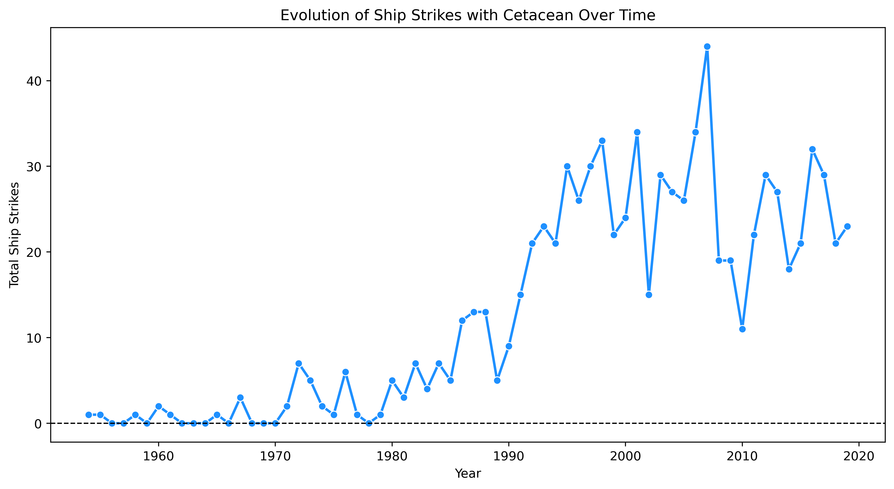

# Project of Data Visualization (COM-480)

| Student's name | SCIPER |
| -------------- | ------ |
| Camille Challier | 311020 |
| Cyrill Strassburg | 377372 |
| Eglantine Vialaneix | 324293 |

[Milestone 1](#milestone-1) • [Milestone 2](#milestone-2) • [Milestone 3](#milestone-3)

## Milestone 1 (21st March, 5pm)

**10% of the final grade**

This is a preliminary milestone to let you set up goals for your final project and assess the feasibility of your ideas.
Please, fill the following sections about your project.

*(max. 2000 characters per section)*

### Dataset

> Find a dataset (or multiple) that you will explore. Assess the quality of the data it contains and how much preprocessing / data-cleaning it will require before tackling visualization. We recommend using a standard dataset as this course is not about scraping nor data processing.
>
> Hint: some good pointers for finding quality publicly available datasets ([Google dataset search](https://datasetsearch.research.google.com/), [Kaggle](https://www.kaggle.com/datasets), [OpenSwissData](https://opendata.swiss/en/), [SNAP](https://snap.stanford.edu/data/) and [FiveThirtyEight](https://data.fivethirtyeight.com/)), you could use also the DataSets proposed by the ENAC (see the Announcements section on Zulip).

For this project, we are working with multiple datasets related to cetaceans. Their preprocessing steps are detailed in the EDA part below.

- **Info about Cetacean**: 
Basic information of all cetaceans can be found in the <strong><a href="https://en.wikipedia.org/wiki/List_of_cetaceans">wikipedia list of cetaceans</a></strong>. For each cetacean species, the list includes information about family, genus, species scientific and common name, level of endangerment, where they live, size illustration, and a photograph. Additionally, each cetacean species has its own wikipedia page with images and additional information. The list has been converted to a pandas dataframe. Images can be accessed via the Wikimedia <strong><a href="https://www.mediawiki.org/wiki/API:Main_page">API</a></strong>. 
- **Global sightings of Cetaceans**: Data on cetacean sightings was downloaded from <strong><a href="https://seamap.env.duke.edu/">OBIS Seamap</a></strong>, a data center for various marine animals. Cetacean data from OBIS is originally sourced from <strong><a href="https://happywhale.com/home">HappyWhale</a></strong> and includes sightings spanning from 1972 to now. Attributes include GPS coordinates, species name, unique animal id, Group size, date of sighting, locality and environmental details.
- **Phylogenetic tree of Cetacean**: From <a href=”https://academic.oup.com/sysbio/article/69/3/479/5601630#202639720”> a paper published in May 2020 in Systematic Biology </a> we could retrieve one of the latest phylogenetic trees of cetaceans. We plan to manually re-transcripted Figures S1 and S3 to display them in a more interactive and playful way along with the rest of the information from this project.
- To assess the **potential threats to cetacean survival**, we explored multiple simple datasets covering climate disruption, ship strikes, and whaling activities:
   - **Climate Disruption**: <strong>[Copernicus](https://marine.copernicus.eu/ocean-climate-portal/sea-surface-temperature)</strong> provides Global Monthly Average Sea Surface Temperatures (SST) Anomalies (deviations from long-term averages) from 1993 to 2021.
   - **Ship Strikes**: <strong><a href="https://iwc.int/management-and-conservation/ship-strikes">IWC Ship Strike Database</a></strong> records incidents of ship collisions with marine mammals since 1954.
   - **Whaling Activities**: <strong><a href="https://iwc.int/management-and-conservation/whaling/total-catches">International Whaling Commission</a></strong> (IWC) on direct whale catches since 1986, including catches per year, whale species, geographic area, nation, and the type of operation (Commercial, Aboriginal, Illegal,...)
   - **Marine Protected Areas**: The <strong><a href="https://www.protectedplanet.net/en/thematic-areas/wdpa?tab=WDPA">World Database on Protected Areas </a></strong> (WDPA), a comprehensive global database of marine and terrestrial protected areas. The WDPA is updated monthly and provides crucial insights into the distribution and extent of protected areas.

### Problematic

> Frame the general topic of your visualization and the main axis that you want to develop.
> - What am I trying to show with my visualization?
> - Think of an overview for the project, your motivation, and the target audience.

More than a century after the peak of commercial whaling most cetacean populations are still struggling to recover. According to a study published in May 2023 in the journal Conservation Biology, as of 2021, approximately 26% of whale, dolphin, and porpoise species are classified as threatened with extinction.

By creating a playful, engaging and interesting way of navigating information about modern cetaceans, this project aims to make information easily accessible and raise awareness about cetaceans, their phylogeny, their current global condition and the various threats they face.

Through our visualizations, we aim to:
1. **Global Overview**: Provide an overview of cetaceans around the world, highlighting the species that are extinct or endangered, using the Red-List status for reference. 
2. **Phylogenetic Tree**: Present a phylogenetic tree to showcase the evolutionary relationships of cetaceans, highlighting extinct species and their connections to modern counterparts. 
3. **Cetacean Sightings**: Display sightings of cetaceans around the globe to help users understand where they live and their migration patterns. Additionally, we aim to compare these locations with protected marine areas and regions of high-risk threats to assess conservation efforts and potential dangers.
4. **Timeline of Threats**: Illustrate the cumulative and ongoing threats to cetaceans, such as the impact of climate change on oceans, maritime traffic, pollution and plastic contamination, and hunting practices over time.

By presenting a comprehensive visualization of their global distribution, their history, and the cumulative impacts of human activities, we seek to inform the public about the critical state of cetacean populations.
The target audience for this project includes environmental activists, marine biologists, educators, and most importantly the general public. By creating an engaging and interactive experience, we aim to captivate a broad audience and encourage a deeper understanding of the challenges cetaceans face, with the hope of fostering greater support for their protection.

### Exploratory Data Analysis

> Pre-processing of the data set you chose
> - Show some basic statistics and get insights about the data

#### 1. Global info about Cetacean
Because this data will be retrieved by ourselves, its quality depends on our scraping methods. Wikipedia has a clean and standardized structure for cetaceans articles and our downloading mainly relies on it to keep a corresponding structure. As a proof of concept, a few images that were successfully retrieved are present in our repository and we show some examples below. The retrieval of other images (comparison in sizes with humans, endangered index, location in the world) and textual information is still in process.

| Photograph of the animal | Size comparison with human | World location of the species |
|-------------------------|-------------------------|---------------------|
|  |  |  |
| Atlantic Spotted Dolphin | Blainville's Beaked Whale | Baird's Beaked Whale |

#### 2. Sighting Data  
The data processing was primarily performed during the download phase using the **OBIS Seamap** website, where we filtered for the relevant cetacean species. Two datasets were extracted, each containing similar information but with different column names. To ensure consistency, these datasets were **concatenated** after aligning their column names and formats. This extracted dataset encompasses records of over 275191 sightings. Some location information, such as country and water zone, is missing for some sightings, but since we have the coordinates, we might not need it or could extract it if necessary. 
For more details on the exploratory data analysis, refer to the **EDA_location.ipynb** notebook.  

As a really large number of events are present in the dataset and in order to visualize the locations of sightings on a world map, we group sightings of similar species and locations. We will determine whether this approach is necessary for the final website as well. 

Note that the marker size represents the number of animals observed at this location.

#### 3. Multiple Threats: Challenges to Cetacean Survival
#####  A- Climate disruption

Anomalies represent deviations from long-term averages. For example, the January 2021 anomaly is calculated as the difference between the sea surface temperature in January 2021 and the climatological average for all January months within the dataset's time span.

#####  B- Maritime traffic

#####  C- Hunting

##### D- Protected Areas

### Related work

> - What others have already done with the data?
> - Why is your approach original?
> - What source of inspiration do you take? Visualizations that you found on other websites or magazines (might be unrelated to your data).
> - In case you are using a dataset that you have already explored in another context (ML or ADA course, semester project...), you are required to share the report of that work to outline the differences with the submission for this class.

### Related and existing work
- **Phylogenetic Tree of Cetaceans**
  - <a href="https://www.onezoom.org/life/@CETACEA=698424?otthome=@CETACEA%3D698424#x718,y927,w1.1043"> OneZoom </a> provides an interactive tree of life visualization, inspiring our effort to create a phylogenetic tree specifically for Cetaceans, incorporating additional study features.

- **Global Sightings of Cetaceans**
   - <strong><a href="https://seamap.env.duke.edu/">OBIS Seamap</a></strong> offers a heatmap of species distribution presence across the world map, allowing users to filter species and examine concentration levels.
  - <strong><a href="https://www.researchgate.net/publication/371807547_A_collaborative_and_near-comprehensive_North_Pacific_humpback_whale_photo-ID_dataset">Whales of Guerrero labs</a></strong> has used this dataset to track North Pacific humpback whale movements.

- **Timeline of Threats**:
To represent threats to cetaceans, we plan to implement interactive line plots or 2D world maps, allowing users to explore many variables over time. Several visualizations have already been made using the datasets previously mentionned on topics such as: Sea Temperature: [Sea Surface Temperature line plot](https://marine.copernicus.eu/ocean-climate-portal/sea-surface-temperature), [NASA - 2D Temperature Map](https://earthobservatory.nasa.gov/images/151743/the-ocean-has-a-fever); Ship Strikes Evolution: [Ship Strikes Evolution Report](https://archive.iwc.int/pages/view.php?ref=17562&k=c9f67e8c17#); Whaling Activities: [2D Map](https://earth.org/international-whaling-commission/).
 

### Originality

Our approach integrates interactivity, enabling users to adjust parameters, highlight individual species with color coding, and explore seasonal migration patterns. Another unique aspect of our approach is the integration of conservation-challenged animals and protected marine areas, linking sightings with conservation efforts and highlighting the relationship between cetacean presence and protected regions as well as their evolutionary tree and how the different species of cetaceans differ from each other. By combining these elements into a single, integrated visualization, we highlight how various threats collectively impact cetacean populations, offering a more comprehensive understanding of their conservation needs.

### Inspiration

- **Phylogenetic Tree of Cetaceans**

Similarly to <a href="https://www.onezoom.org/life/@CETACEA=698424?otthome=@CETACEA%3D698424#x718,y927,w1.1043"> OneZoom </a>, we would like to create an interactive tree of the cetacean life displaying various information alongside by hovering or clicking on a leaf of their choice.

- **Global Sightings of Cetaceans**

We aim to develop a 3D Navigable Globe for visualizing cetacean sightings and conservation efforts. Notable JavaScript-based visualizations like [Populated Place Visualization in D3.js](https://blog.maptheclouds.com/learning/3d-globe-map-in-d3-js-populated-places-on-earth-%F0%9F%8C%8D) and [Population Heatmap in React](https://vasturiano.github.io/react-globe.gl/example/population-heatmap/) showcase interactive 3D globes displaying global datasets, which could be adapted for our project.

## Milestone 2 (18th April, 5pm)

**10% of the final grade**

## Milestone 3 (30th May, 5pm)

**80% of the final grade**

## Late policy

- < 24h: 80% of the grade for the milestone
- < 48h: 70% of the grade for the milestone

